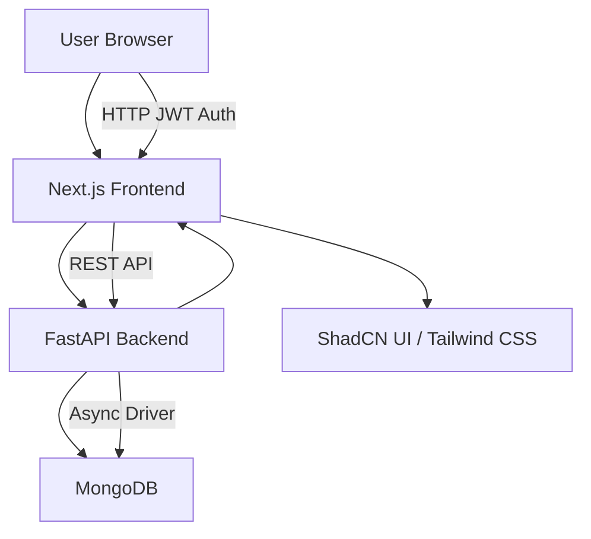
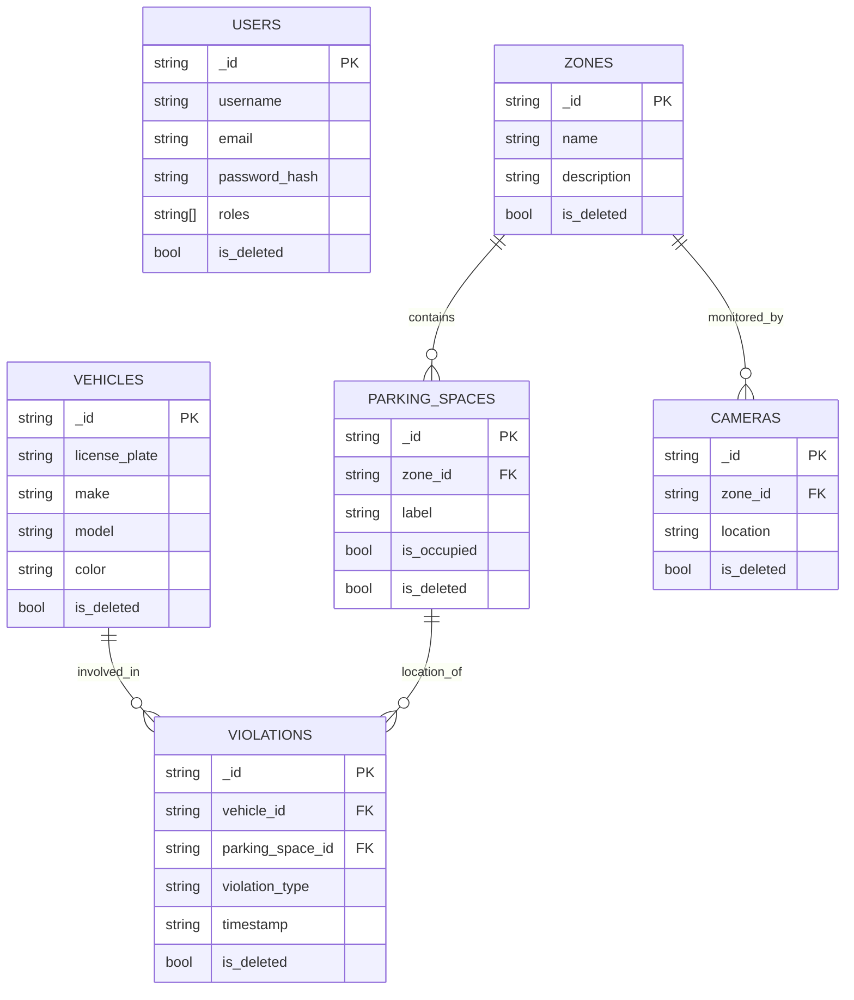
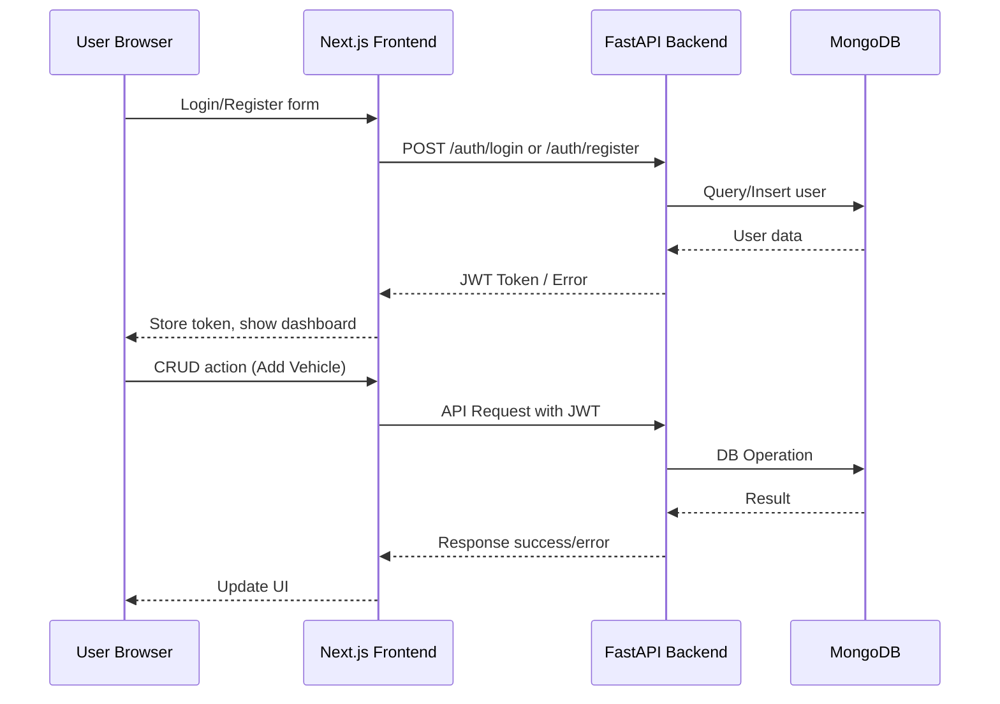

# ParkSense AI

## Table of Contents

- [Project Structure](#project-structure)
- [System Diagrams](#system-diagrams)
- [Backend](#backend-fastapi--mongodb)
- [Frontend](#frontend-nextjs--shadcn-ui)
- [Development Notes](#development-notes)
- [API Endpoints](#api-endpoints)

A full-stack solution for smart parking management, featuring a FastAPI backend (with MongoDB) and a modern Next.js frontend.

---

## Project Structure

```
.
├── app/                   # FastAPI backend (Python)
├── parksense-frontend/    # Next.js frontend (TypeScript)
├── requirements.txt       # Backend dependencies
├── .env                   # Backend environment variables (not committed)
└── README.md
```

---

## System Diagrams

### 1. System Architecture



### 2. Database Entity-Relationship Diagram (ERD)



### 3. API Flow Diagram



---

## Backend (FastAPI + MongoDB)

### Features
- User authentication & registration (JWT, hashed passwords, role-based access)
- CRUD APIs for users, cameras, zones, parking spaces, vehicles, violations
- Filtering, pagination, sorting, bulk operations, soft delete
- MongoDB Atlas/cloud/local support

### Setup

1. **Install dependencies**
   ```bash
   pip install -r requirements.txt
   ```

2. **Set up environment variables**
   Create a `.env` file in the root directory:
   ```
   MONGO_URI=your_mongodb_uri
   MONGO_DB=parksense
   SECRET_KEY=your_secret_key
   ```

3. **Run MongoDB**
   - Use MongoDB Atlas or run locally and update `MONGO_URI` accordingly.

4. **Start the FastAPI server**
   ```bash
   uvicorn app.main:app --reload
   ```

5. **Test the health endpoint**
   - Visit [http://localhost:8000/health](http://localhost:8000/health)

---

## Frontend (Next.js + ShadCN UI)

### Features
- Modern UI with ShadCN components and Tailwind CSS
- JWT login/logout, AuthContext, admin detection
- Protected dashboard and navigation
- CRUD pages for all entities (users, vehicles, zones, cameras, parking spaces, violations)
- Role-based UI (admin/user), error/loading states

### Setup

1. **Install dependencies**
   ```bash
   cd parksense-frontend
   npm install
   ```

2. **Run the development server**
   ```bash
   npm run dev
   ```

3. **Open [http://localhost:3000](http://localhost:3000) in your browser**

---

## Development Notes

- **.env** and other secrets are not committed. See setup above.
- Both backend and frontend are fully functional and ready for integration.
- CORS is enabled for local development.
- For deployment, see Next.js and FastAPI deployment guides.

---

## API Endpoints

<details>
<summary>Click to expand endpoints</summary>

### Authentication
- `POST /auth/register` - User registration
- `POST /auth/login` - User login
- `GET /auth/me` - Get current user info

### Users
- `GET /users` - List all users
- `POST /users` - Create new user
- `GET /users/{id}` - Get user by ID
- `PUT /users/{id}` - Update user
- `DELETE /users/{id}` - Delete user

### Vehicles
- `GET /vehicles` - List all vehicles
- `POST /vehicles` - Create new vehicle
- `GET /vehicles/{id}` - Get vehicle by ID
- `PUT /vehicles/{id}` - Update vehicle
- `DELETE /vehicles/{id}` - Delete vehicle

### Zones
- `GET /zones` - List all zones
- `POST /zones` - Create new zone
- `GET /zones/{id}` - Get zone by ID
- `PUT /zones/{id}` - Update zone
- `DELETE /zones/{id}` - Delete zone

### Parking Spaces
- `GET /parking-spaces` - List all parking spaces
- `POST /parking-spaces` - Create new parking space
- `GET /parking-spaces/{id}` - Get parking space by ID
- `PUT /parking-spaces/{id}` - Update parking space
- `DELETE /parking-spaces/{id}` - Delete parking space

### Cameras
- `GET /cameras` - List all cameras
- `POST /cameras` - Create new camera
- `GET /cameras/{id}` - Get camera by ID
- `PUT /cameras/{id}` - Update camera
- `DELETE /cameras/{id}` - Delete camera

### Violations
- `GET /violations` - List all violations
- `POST /violations` - Create new violation
- `GET /violations/{id}` - Get violation by ID
- `PUT /violations/{id}` - Update violation
- `DELETE /violations/{id}` - Delete violation

</details>